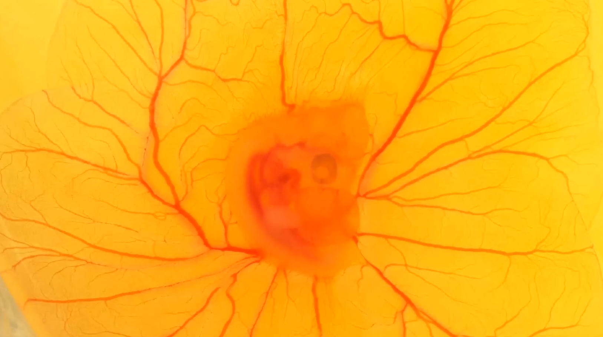

# Heart Rate Detection from Video

This project uses OpenCV to analyze an infrared video of a chicken heart and estimate its heart rate by detecting variations in contour areas.

## 📁 Project Structure

project

-> main.py

-> requirements.txt

-> day3_chicken_heartbeat.mp4

-> README.md


---

## ⚙️ Installation

1. **Clone the repository (if needed)**  
   Or simply place all the files in the same folder.

2. **Create a virtual environment (optional but always recommended)**


```bash
python -m venv venv
venv\Scripts\activate  # On Windows

3. Install dependencies

pip install -r requirements.txt

From the project/ folder, run:

python main.py


❗ Note
If you get an error related to cv2.imshow, make sure you are not using opencv-python-headless.

```
This project is organized into several key steps aimed at analyzing a video of an embryo to determine its heartbeat 
through image segmentation and morphological processing.

Step 0: Frame Extraction
The video is first decomposed into individual frames, which are then analyzed separately. This allows for frame-by-frame processing and analysis.

Step 1: Color Space Conversion
Frames are initially read in RGB format, which is not ideal for our segmentation task.
Instead, we convert each frame to HSV (Hue, Saturation, Value) format:

Why HSV?
HSV separates color information (hue) from brightness (value), which allows for more effective thresholding and segmentation.




Part 2 dealing with noise:
Our image is met with noise due to the poor quality of the video. The noise is removed using an opening, which is an erosion followed by a dilation (the white noise are removed with dilation and the dilation is here to prevent the AoI(Area of Interrest) from shrinking)


Note: 
We choose the largest remaining contour to represent the AoI (Area of Interest). This approach is preferred over stricter thresholds, 
which might fail to detect the AoI in certain frames.

Part 3: Heartbeat Detection:

With the AoI segmented in each frame, we track its area over time.

   • As the embryo's heart beats, the AoI expands and contracts.

   • A heartbeat is detected when the area reaches a local maximum, indicating a pulse.

This step translates changes in segmented area into a measurable heart rate.


